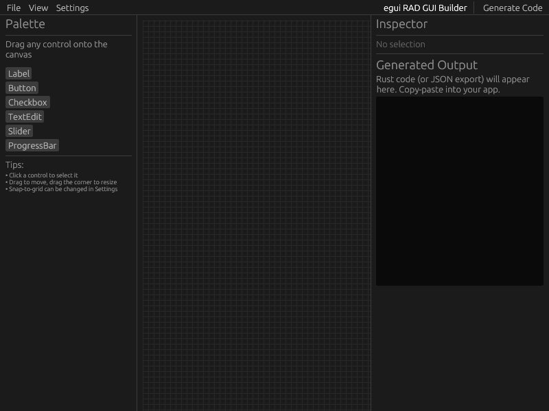

# egui-rad-builder
Tool for quickly designing egui user interfaces.  This tool is under active development.  UIs built with it should build and compile, but there are still many rough edges.  PRs welcome.



# build
```shell
cargo build
```

# run
```shell
cargo run
```

# use
- Drag and drop controls from the pallette into the central canvas.
- Control properties can be edited in the Inspector on the right.
- Click 'Generate Code' to produce your UI boilerplate in the output text area.
- Create a new Rust project with 'cargo new project_name'
- Enter the project folder with 'cd project_name'
- Add egui and eframe dependencies to the project with 'cargo add egui eframe'
- Copy the generated code and paste it into 'src/main.rs'
- Build and run the project with 'cargo build'

# todo
- add panels
- add menus
- flesh out font, scaling, color options
- add https://github.com/trevyn/egui_node_graph2
- add https://github.com/LennysLounge/egui_ltreeview
