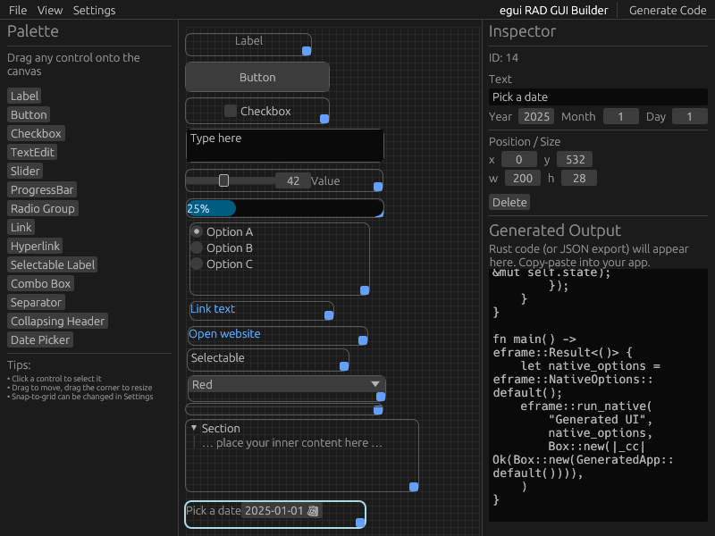
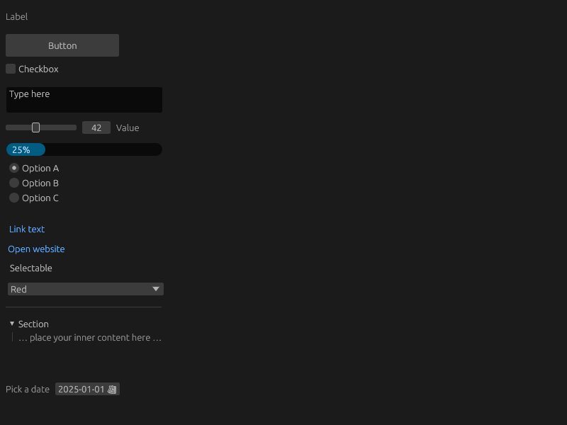

# egui-rad-builder
Tool for quickly designing egui user interfaces.  This tool is under active development.  UIs built with it should build and run, but there are still many rough edges.  Issues and PRs welcome.

 

# build
```shell
cargo build
```

# run
```shell
cargo run
```

# use
- Drag and drop controls from the pallette into the central canvas.
- Control properties can be edited in the Inspector on the right.
- Click 'Generate Code' to produce your UI boilerplate in the output text area.
- Create a new Rust project with 'cargo new project_name'
- Enter the project folder with 'cd project_name'
- Use the following Cargo.toml
```toml
[package]
name = "project_name"
version = "0.1.0"
edition = "2024"

[dependencies]
chrono = "0.4.42"
eframe = "0.33.0"
egui = "0.33.0"
egui_extras = { version = "0.33.0", features = ["chrono"] }
```
- Copy the generated code and paste it into 'src/main.rs'
- Build and run the project with 'cargo build'

# todo
- add panels
- add menus
- add support for multiple 'pages', 'screens', or 'tabs'
- add support for columns
- flesh out font, scaling, color options in inspector
- add https://github.com/trevyn/egui_node_graph2
- add https://github.com/LennysLounge/egui_ltreeview
- implement support for rotation
- implement support for modals
- implement support for tooltips
- implement support for right-click menus
- implement support for scenes
- implement support for tables
- implement settings for window title, closeable, collapsible, resizeable, constrained, horizontal scroll, vertical scroll, anchoring
